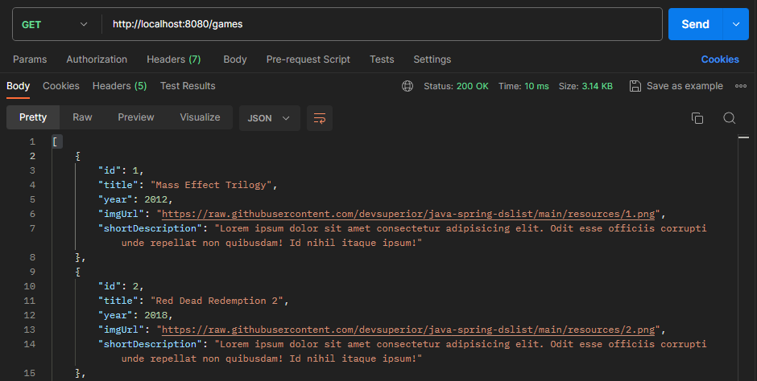
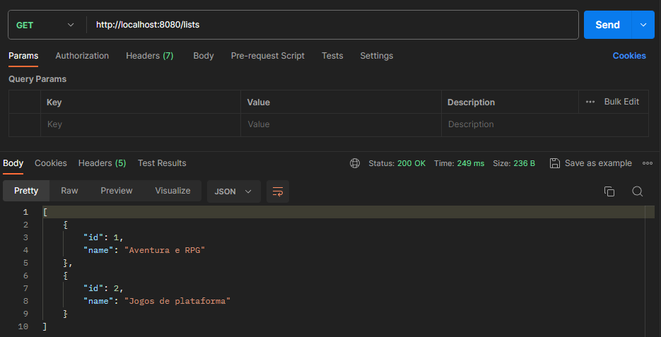

# GamesList-Backend

GamesList é uma aplicação Backend desenvolvida durante a Semana DevSuperior, evento realizado pela escola de programação [DevSuperior](https://devsuperior.com.br/ "DevSuperior").

O objetivo desse projeto foi aprender como um projeto spring boot funciona, como ele é estruturado e como ele faz essa ponte entre a frontend e o banco de dados.

Ele permite consultas em uma lista de jogos, trazendo informações sobre esse jogos e os separando por gênero. Além disso, é possível alterar ordem desses jogos na lista.
## Aprendizados

- Estrutura de projeto Spring Rest
- Padrão de Camadas
- Controller, service, repository
- Padrão DTO
- Entidades e ORM
- Consultas SQL no Spring Data JPA
- Perfis de Projeto
- Ambiente local com Docker Compose
- Postman
## Modelo de domínio


## Screenshots



## Deploy

Para fazer o deploy desse projeto rode

```bash
# clonar repositório
git clone https://github.com/ViictorP/GamesList-Backend.git

# entrar na pasta do projeto
cd GamesList-Backend

# executar o projeto
./mvnw spring-boot:run
```
## Autores

- [@ViictorP](https://www.github.com/ViictorP)

